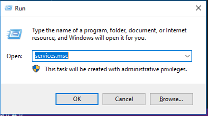
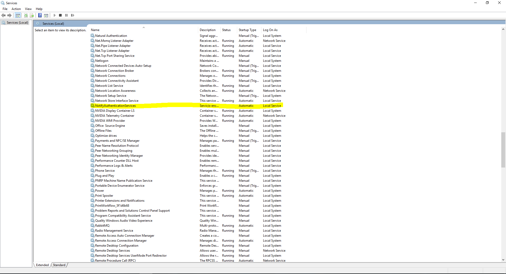
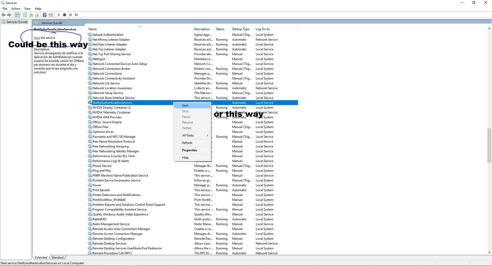

# Notify Authentication Services
 
## What is?

This is a windows service which is responsible for notifying to AdmBalanceo's app when an user
has logged in into OnBase for the first time in a day and need a solicitude for working with.

## How to install it?

To install this service please read carefuly and follow this steps:

 1. Search "command Prompt" or "cmd" and run it as an administrator.

**Notes**  : From now on we are assuming that you are already in the command pront window.

 2. Write the below command and then press Enter:
 - `cd C:\Windows\Microsoft.NET\Framework\v4.0.30319`

 **Notes**  : In the above command we are assuming that the windows directory is in "C:" partition and the installed framework is running in a 32 bits architecture. If this is not your case try with the following command instead:
 - `cd <WINDIR>\Windows\Microsoft.NET\Framework[\<ARCHITECTURE>]\v4.0.30319`
 ```
 <WINDIR> = windows directory, e.g: C:, F:, etc.
 <ARCHITECTURE> = 64, used just for 64 bits architectures.
 ``` 

 3. Write the below command and then press Enter:

 **Notes**  : Before running this command check the "NotifyAuthenticationService.exe.config" file and confirm that all the configurations are correct. This file is located with the files needed for installing this services.
 - `InstallUtil.exe <SERVICEPATH>\NotifyAuthenticationService.exe`
  ```
  <SERVICEPATH> = the path where the files needed for the installation of the router services are stored. e.g: C:\NotifyAuthenticationServices
  ```
**Notes**  : If after you press the enter key Windows display a white pop asking for credencials in the user account field just enter ".\\" and leave the other fields empty.

 ## How to start it?
 
 
 